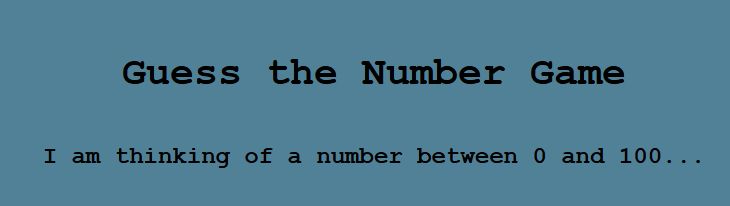

# Guessing Game

## Overview
**Number Guessing Game** is a simple browser-based game where the player tries to guess a randomly generated number between 1 and 100. With only 10 attempts, the player receives feedback after each guess—either "Too high," "Too low," or "You guessed it!"—until they win or run out of guesses.

I chose this game because it’s a great way to practice core programming concepts like loops, conditionals, DOM manipulation, and user feedback. It’s also a fun challenge to architect clean logic and UI flow in a beginner-friendly format.

---

## Screenshot / Logo

---

### How to Play
- Enter a number between 1 and 100.
- Click "Submit" to make a guess.
- You’ll receive feedback: “Too high,” “Too low,” or “You guessed it!”
- You have 10 attempts to guess correctly.
- After 10 incorrect guesses, the game ends and reveals the correct number.

### Planning Materials
[View my pseudocode and planning notes](https://github.com/KieshaWalker/Guessing-Game/blob/main/js/app.js)

---

## Attributions
- [WebAIM Contrast Checker](https://webaim.org/resources/contrastchecker/) – used to ensure accessible color contrast.
- [Google Fonts](https://fonts.google.com/) – for custom typography.
- [MDN Web Docs](https://developer.mozilla.org/) – for JavaScript reference and DOM methods.

---

## Technologies Used
- HTML5
- CSS3 (Flexbox layout)
- JavaScript (ES6+)
- Git & GitHub for version control
- GitHub Pages for deployment
- chatGPT for debugging questions

---

## Next Steps (Stretch Goals)
- Add difficulty levels (Easy, Medium, Hard with different attempt limits)
- Add animations for feedback messages

---
